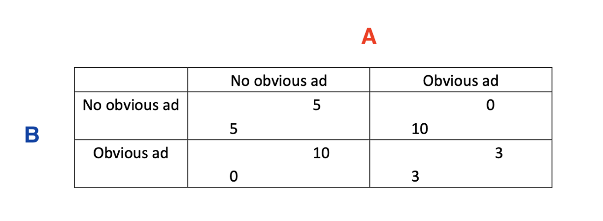
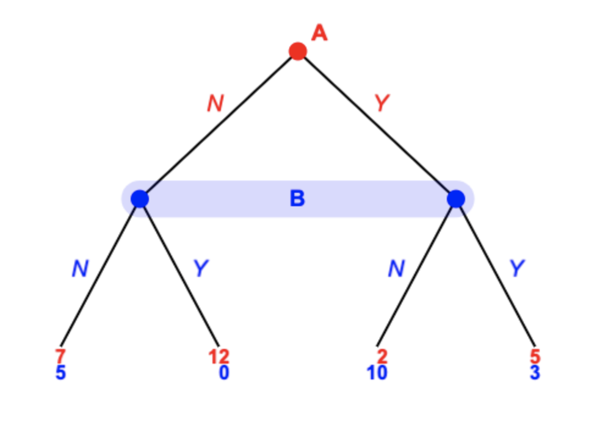
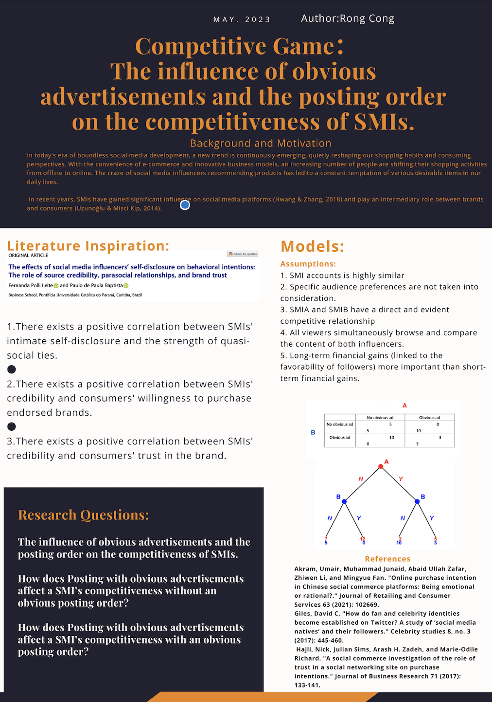

# # Competitive Game: The influence of obvious advertisements and the posting order on the competitiveness of Social media influencers
## Project information
- **Author**: Rong Cong, 2024,Duke Kunshan University
- **Instructor**: Prof. Luyao Zhang, Duke Kunshan University
- **Disclaimer**: Submissions to the Problem Set No. or Final Project for [COMPSCI/ECON 206 Computational Microeconomics, 2023 Spring (Seven Week - Second)](https://ce.pubpub.org/) instructed by Prof. Luyao Zhang at Duke Kunshan University.
- **Acknowledgments**:  I would like to thank Prof. Luyao Zhang for her profound knowledge and enthusiasm inspire my love of learning, and her patience for answering countless questions for me. Thank you for yiyuan, haowen and wanlin's cooperating with me in learning and sharing insights. Their open mind and in-depth discussion helped me to have a deeper understanding of the course content. Finally, I would like to thank the whole class. I am extremely lucky and humbled by your encouragement and help in this class. Your solidarity and support make us a better learning team. I sincerely thank you for your friendship and support.
- **Project Summary**: 
  - [Summarize the Background/Motivation]In today's era of boundless social media development, a new trend is continuously emerging, quietly reshaping our shopping habits and consuming perspectives. With the convenience of e-commerce and innovative business models, an increasing number of people are shifting their shopping activities from offline to online. The craze of social media influencers recommending products has led to a constant temptation of various desirable items in our daily lives.
In the process of online consumption, there are risks involved in the exchange between consumers and brands, making trust play a crucial role. Social Media Influencers (SMIs) serve as a bridge connecting brands and consumers. When consumers establish a strong level of trust with SMIs, their awareness and favorability towards brands recommended by SMIs gradually increase.In recent years, SMIs have gained significant influence on social media platforms and play an intermediary role between brands and consumers. By 2022, the estimated value of influencer marketing is expected to reach $15 billion, compared to $8 billion in 2019. From these statistics, it can be seen that becoming a high-quality SMIs who can consistently attract followers can bring substantial economic benefits. Behind these significant economic benefits, there are collaborations with brands and advertising placements. Additionally, there is intense competition among SMIs in the same field. 

  - [Research Questions]Major research question: Competitive Game: The influence of obvious advertisements and the posting order on the competitiveness of social media influencers.
In order to better investigate this research question, this main problem has been divided into two small problems, corresponding to two different situations and models. How does Posting with obvious advertisements affect a SMI’s competitiveness without an obvious posting order? How does Posting with obvious advertisements affect a SMI’s competitiveness with an obvious posting order?

Here is the answer by chatgpt：

  - [Application Scenario]This game environment simulates real-life social networking platforms. In this virtual world, we have two players—Player A and Player B, representing two social media influencers (SMIs) with similar fan bases and content types. There is a clear competition between these two players as they strive to gain the favor of the audience and stand out on this virtual social media platform.
Player A and Player B are aware that in this highly competitive environment, they need to employ a series of strategies to attract the attention and support of the audience.
In this virtual social media platform, Player A and Player B engage in intense competition, vying for the audience's favor. They know that the support and positive feedback from the audience will directly manifest in the form of likes and views data. Those players who can win more favor from the audience will attract more fans and collaboration opportunities. Therefore, Player A and Player B spare no effort in their endeavors to stand out on this virtual social media platform, aiming to achieve success in this fiercely competitive environment.
  - [Methodology]
Two models have been made to illustrate the impact of releasing explicit advertisements without any apparent order on the payoffs of SMIs. The numbers in the model represent the players' final payoff, with higher numbers indicating that they have gained more favorability from the audience and therefore have a greater competitive edge.
Given the complexity of real social media environments, the game models makes several assumptions.
1. The content of both SMI accounts is highly similar, with an equal number of followers and exposure to the same level of traffic.
2. Specific audience preferences (such as preferences for certain details) are not taken into consideration.
3. SMIA and SMIB have a direct and evident competitive relationship, excluding competition with anyone else.
4. All viewers simultaneously browse and compare the content of both influencers. This means that the audience has a clear understanding of the order in which the two bloggers post and whether or not they publish advertisements.
5. Long-term financial gains are more important than short-term financial gains. The favorability and trust of followers contribute to the long-term development of influencers and enable them to obtain sustained earnings. Therefore, while advertising may bring short-term financial gains to influencers, it can to some extent lower the favorability of the audience towards them, thereby hindering their long-term earnings.


  - [Results]
  Result for Model 1
  
  The Nash Equilibrium in this competitive game is (no obvious ad, no obvious ad). In this equilibrium, both players choose not to release post with obvious advertisements which leads to a payoff 5 for each other. A strategy is a Nash Equilibrium strategy if it is the best strategy for an agent, given the strategies the other players are actually using[16]. In this competitive game, neither player can unilaterally change their strategy to improve their own payoff, given the strategy of the other player. As a result, no matter what the other side chooses, not releasing posts with obvious advertisements is always the best choice under the circumstances. Therefore, in this case, the NE strategy is (no obvious ad, no obvious ad), and both players end up with a suboptimal outcome.

Result for Model 2

In Model 2, there is an extreme Nash equilibrium, which occurs when A and B both choose not to release post with obvious advertisement. In this case, A's payoff is 7 and B's payoff is 5，neither player has a better strategy to win.Thus, in this case, both players are more likely to choose not to release post with obvious advertisement.
  - 
  - [Intellectual Merits and Practical impacts of your project.] Possible future extensions： This study can be further expanded in the following directions. Firstly, expanding the scope of the research to consider the competitiveness of SMIs on different social media platforms. Secondly, exploring the impact of content types and formats on competitiveness. Thirdly, analyzing target audiences. Consider further researching the impact of obvious advertisements and the posting order on the competitiveness of different target audiences. How your research could inspire further research and how your research could be applied to solve real-world issues：Firstly, this study can fill the research gap in the understanding of SMIs’ competitiveness. Secondly, this study can help people understand the role of obvious advertisements and the posting order in competitiveness. Thirdly, this study can contribute to improving the competitiveness of SMIs. Fourthly, this study can optimize advertising and social media marketing strategies. Fifthly, this study can drive the research and development of social media. 

 
   
Note: please insert the screenshot of the answers to your research question by ChatGPT. The methodology that you use to address the research questions must be more innovative than both the current literature and ChatGPT. 

## Table of Contents

- model
- code
- spotlight
- more about the author
- references

### Model
- Game Environment

This game environment simulates real-life social networking platforms. In this virtual world, we have two players—Player A and Player B, representing two social media influencers (SMIs) with similar fan bases and content types. There is a clear competition between these two players as they strive to gain the favor of the audience and stand out on this virtual social media platform.
Player A and Player B are aware that in this highly competitive environment, they need to employ a series of strategies to attract the attention and support of the audience.
In this virtual social media platform, Player A and Player B engage in intense competition, vying for the audience's favor. They know that the support and positive feedback from the audience will directly manifest in the form of likes and views data. Those players who can win more favor from the audience will attract more fans and collaboration opportunities. Therefore, Player A and Player B spare no effort in their endeavors to stand out on this virtual social media platform, aiming to achieve success in this fiercely competitive environment.

- Solution Concept

Here is Model 1, which simulates the case with no obvious posting order.
 
 If both SMIA and SMIB choose not to release explicit advertisements, their payoff will be 5 each.
If both SMIA and SMIB choose to release explicit advertisements, their payoff will be 3 each.
If SMIA chooses to release explicit advertisements but SMIB chooses not to, SMIA's payoff will be 0, while SMIB's payoff will be 10.
If SMIB chooses to release explicit advertisements but SMIA chooses not to, SMIB's payoff will be 0, while SMIA's payoff will be 10.


Here is Model 2, which simulates the case with obvious  posting order.
 
 If both SMIA and SMIB choose not to release explicit advertisements, their respective earnings will be 7 and 5.
If both SMIA and SMIB choose to release explicit advertisements, their respective earnings will be 5 and 3.
If SMIA chooses to release explicit advertisements, but SMIB chooses not to, SMIA's earnings will be 2, and SMIB's earnings will be 10.
If SMIB chooses to release explicit advertisements, but SMIA chooses not to, SMIB's earnings will be 0, and SMIA's earnings will be 12.


- Evaluations: e.g. efficiency and fairness


### Code
- Game Environment

The Competitive game environment simulates real-life social networking platforms. In this virtual world, there are have players—Player A and Player B, representing two social media influencers (SMIs) with similar fan bases and content types. There is a clear competition between these two players as they strive to gain the favor of the audience and stand out on this virtual social media platform.

- Here is the link for Strategic plays and Equilibruim Evaluations: 


### Spotlight
- Posters

This poster gives an overview of causal research ouline. It contains five sections: Background and Motivation, Research Questions, Literature inspiration, Models, Referenes.
This poster is created by Canva.
- Figures

Here is the link for overleaf pdf
Here is the link for overleaf zip

- Slides

Here is the link for slides
=
- Review articles

Here is the link for all the review articles

- Media appearance

Media appearance Using Colab and Canvas to help the project.

### More about the Author
 
 
-  As a junior majoring in political economy, Rong Cong is very interested in economics, anthropology and psychology. She hopes to do enough cross-disciplinary research and study in the future. At the same time, Rong Cong is also a music lover. This is a cover of her song 👉🏻https://y.music.163.com/m/artist?app_version=8.9.61&id=46956986&userid=1572161264&dlt=0846.

### References

- Literature References in [Chicago Author-Date](https://www.chicagomanualofstyle.org/tools_citationguide/citation-guide-2.html) Style and [BibTex](https://scholar.google.com/) 

Levin, Dan, and Luyao Zhang. 2020. “Bridging Level-K to Nash Equilibrium.” *The Review of Economics and Statistics* 104 (6): 1329–40. https://doi.org/10.1162/rest_a_00990.

```
@article{levin2022bridging,
  title={Bridging level-k to nash equilibrium},
  author={Levin, Dan and Zhang, Luyao},
  journal={Review of Economics and Statistics},
  volume={104},
  number={6},
  pages={1329--1340},
  year={2022},
  publisher={MIT Press One Rogers Street, Cambridge, MA 02142-1209, USA journals-info~…}
}
```

